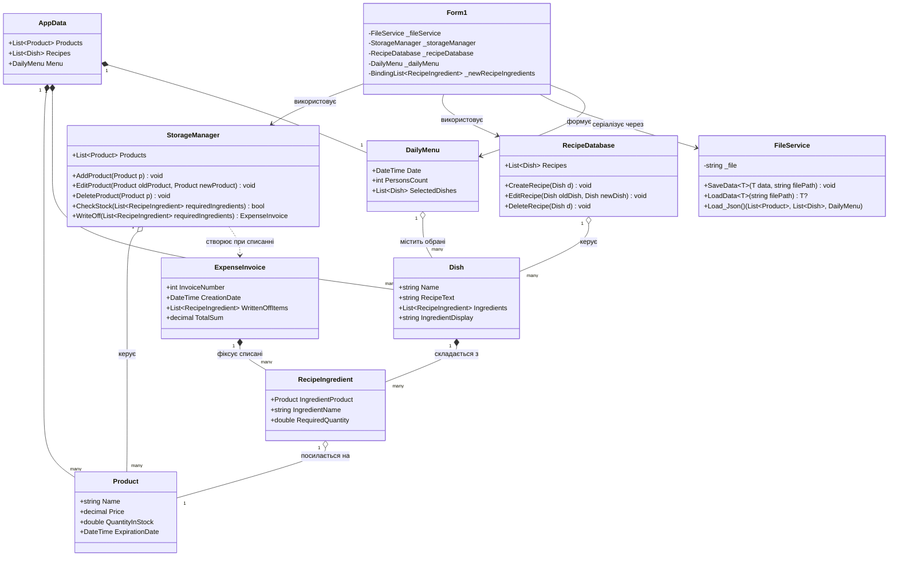

# 👨‍🍳 Head Chef (Шеф-Кухар)

[](https://dotnet.microsoft.com/)
[](https://learn.microsoft.com/dotnet/csharp/)
[-0078D6?logo=windows&logoColor=white)](https://learn.microsoft.com/dotnet/desktop/winforms/)
[](https://www.json.org/)
[-blue)](#)

> **Head Chef** — десктопний програмний комплекс для автоматизації робочого місця шеф-кухаря та завідувача виробництвом у закладах громадського харчування (ресторани, кафе, їдальні). Програма забезпечує повний цикл обліку складських запасів, створення технологічних карт рецептур, формування щоденного меню, розрахунку потреби в інгредієнтах на задану кількість персон і списання продуктів зі складу з оформленням видаткових накладних.

Проєкт розроблено в межах курсу **«Об'єктно-орієнтоване програмування»** (ХНУРЕ / NURE).

---

## 📑 Зміст

- [✨ Ключові можливості](#-ключові-можливості)
- [🏗️ Архітектура проєкту (ООП)](#️-архітектура-проєкту-ооп)
  - [Діаграма класів](#діаграма-класів)
  - [Датакласи та сутності (Models)](#датакласи-та-сутності-models)
  - [Класи-менеджери (Managers)](#класи-менеджери-managers)
  - [Сервіси (Services)](#сервіси-services)
  - [Інтерфейс користувача (UI)](#інтерфейс-користувача-ui)
- [📂 Структура проєкту](#-структура-проєкту)
- [🛠️ Технологічний стек](#️-технологічний-стек)
- [🚀 Встановлення та запуск](#-встановлення-та-запуск)
  - [Вимоги](#вимоги)
  - [Клонування та збірка](#клонування-та-збірка)
  - [Запуск портативної версії](#запуск-портативної-версії)
  - [Налаштування шляху до бази даних](#налаштування-шляху-до-бази-даних)
- [📖 Інструкція користувача](#-інструкція-користувача)
- [📊 Попередньо завантажені дані](#-попередньо-завантажені-дані)
- [👨‍💻 Автор](#-автор)

---

## ✨ Ключові можливості

### 📦 1. Управління складом продуктів (Склад)
- **Облік товарів**: відстеження назви продукту, ціни за одиницю (грн), наявної кількості та кінцевого терміну придатності.
- **Додавання продуктів**: зручна форма з контролем валідності значень (назва до 50 символів, невід'ємна ціна та кількість, майбутній термін придатності) та перевіркою на дублікати.
- **Редагування та видалення**: швидке внесення коригувань у картку товару або вилучення продукту зі складу.
- **Швидкий пошук**: динамічна фільтрація каталогу залишків за назвою в режимі реального часу.

### 📖 2. База рецептур та технологічних карт (База рецептів)
- **Каталог страв**: зберігання назви, покрокового опису технології приготування та списку необхідних інгредієнтів.
- **Конструктор рецепта**: вибір інгредієнтів із номенклатури складу із зазначенням точної норми витрати на 1 порцію.
- **Редагування та видалення рецептур**: оновлення складу чи кроків приготування, видалення страв із діалогом підтвердження.
- **Пошук страв**: миттєва фільтрація бази рецептів за назвою.

### 🍽️ 3. Планування меню та списання запасів (Меню на день)
- **Складання добового меню**: додавання обраних страв із бази рецептів до активного меню поточного дня.
- **Розрахунок потреби в інгредієнтах**: автоматичний перерахунок сумарної маси/кількості кожного продукту залежно від вказаної кількості гостей/порцій (`PersonsCount`).
- **Перевірка запасів (`CheckStock`)**: порівняння сумарної потреби за меню з фактичними залишками продуктів на складі перед приготуванням.
- **Автоматичне списання (`WriteOff`)**: віднімання необхідної кількості інгредієнтів від залишків на складі з округленням до 3 знаків після коми.
- **Формування видаткової накладної (`ExpenseInvoice`)**: генерація документа з випадковим номером, точною датою та часом створення, переліком списаних позицій та розрахунком підсумкової вартості списання.

### 💾 4. Збереження та завантаження даних (JSON Persistence)
- Збереження всього стану програми (склад, рецепти, поточне меню) в єдиний структурований JSON-файл (`data.json`).
- Автоматичне завантаження даних при відкритті форми та збереження при закритті застосунку.

---

## 🏗️ Архітектура проєкту (ООП)

Проєкт спроєктовано з дотриманням принципів об'єктно-орієнтованого програмування, принципів розділення відповідальності (Separation of Concerns) та архітектурного шаблону шарів: **Моделі даних → Бізнес-логіка (Менеджери) → Допоміжні сервіси → Презентаційний шар (UI)**.

### Діаграма класів



### Датакласи та сутності (Models)

| Клас | Опис | Ключові поля та властивості |
| :--- | :--- | :--- |
| **`Product`** | Описує одиницю товару/сировини на складі | `Name` (назва), `Price` (ціна у грн), `QuantityInStock` (залишок), `ExpirationDate` (термін придатності) |
| **`RecipeIngredient`** | Пов'язує продукт із необхідною масою/об'ємом для страви | `IngredientProduct` (посилання на `Product`), `RequiredQuantity` (кількість), `IngredientName` (відображувана назва) |
| **`Dish`** | Технологічна картка кулінарної страви | `Name` (назва), `RecipeText` (текст інструкції), `Ingredients` (список норм інгредієнтів), `IngredientDisplay` (форматований рядок для сітки) |
| **`DailyMenu`** | Меню на поточний обраний робочий день | `Date` (дата меню), `PersonsCount` (кількість осіб), `SelectedDishes` (список обраних страв) |
| **`ExpenseInvoice`** | Документ-фіксація факту списання запасів зі складу | `InvoiceNumber` (номер накладної), `CreationDate` (дата/час), `WrittenOffItems` (списані позиції), `TotalSum` (підсумкова сума) |
| **`AppData`** | Коренева модель-контейнер для JSON-серіалізації | `Products` (список продуктів), `Recipes` (список рецептів), `Menu` (поточне меню) |

### Класи-менеджери (Managers)

- **`StorageManager`**: відповідає за управління запасами:
  - `AddProduct()`, `EditProduct()`, `DeleteProduct()` — базова модифікація номенклатури складу;
  - `CheckStock(requiredIngredients)` — перевіряє, чи достатньо кожного інгредієнта для приготування меню;
  - `WriteOff(requiredIngredients)` — списує розраховані обсяги продуктів з балансу складу, перераховує залишкову масу та генерує документ `ExpenseInvoice` із загальною сумою.
- **`RecipeDatabase`**: відповідає за каталог страв:
  - `CreateRecipe()`, `EditRecipe()`, `DeleteRecipe()` — створення, коригування та видалення рецептур.

### Сервіси (Services)

- **`FileService`**: шар роботи з файловою системою:
  - Використовує `System.Text.Json` із налаштуванням `WriteIndented = true`;
  - Універсальні узагальнені методи `SaveData<T>()` та `LoadData<T>()`;
  - Метод `Load_Json()` завантажує стан або ініціалізує початкові порожні списки у разі відсутності файлу.

### Інтерфейс користувача (UI)

- **`Form1`**: головне вікно застосунку на Windows Forms:
  - `DailyMenu` (Вкладка «Меню на день»): вибір страв, таблиця запланованих позицій, лічильник персон, кнопка списання та формування накладної.
  - `Storage` (Вкладка «Склад»): таблиця залишків продуктів, поле пошуку, панель додавання та редагування товарів.
  - `RecipeDatabase` (Вкладка «База рецептів»): таблиця рецептів, панель створення/редагування технологічної карти з динамічним списком інгредієнтів (`IngredientsDG`).

---

## 📂 Структура проєкту

```text
head-chef/
├── ClassDescription.txt           # Текстовий опис концепції класів
├── README.md                      # Документація проєкту
└── head-chef/                     # Каталог вихідного коду рішення
    ├── Form1.cs                   # Код логіки головної форми (GUI)
    ├── Form1.Designer.cs          # Дизайнер елементів форми WinForms
    ├── Form1.resx                 # Ресурси головної форми
    ├── Program.cs                 # Точка входу в програму (Main)
    ├── head-chef.csproj           # Файл проєкту .NET 10.0
    ├── head-chef.slnx             # Файл рішення (Solution)
    ├── Jsons/                     # Каталог збереження бази даних
    │   └── data.json              # Файл бази даних у форматі JSON
    ├── Managers/                  # Класи бізнес-менеджерів
    │   ├── RecipeDatabase.cs      # Управління базою рецептів
    │   └── StorageManager.cs      # Управління складськими запасами
    ├── Models/                    # Датакласи та моделі сутностей
    │   ├── AppData.cs             # Головний контейнер збереження
    │   ├── DailyMenu.cs           # Меню на день
    │   ├── Dish.cs                # Модель страви/рецепта
    │   ├── ExpenseInvoice.cs      # Видаткова накладна списання
    │   ├── Product.cs             # Модель товару на складі
    │   └── RecipeIngredient.cs    # Інгредієнт технологічної карти
    ├── Services/                  # Допоміжні сервіси
    │   └── FileService.cs         # Сервіс читання/запису JSON
    └── PortableVersion/           # Зібрана портативна версія програми
        ├── head-chef.exe          # Готовий виконуваний файл
        ├── head-chef.dll
        ├── head-chef.runtimeconfig.json
        └── Jsons/
            └── data.json          # Локальна база даних портативної версії
```

---

## 🛠️ Технологічний стек

- **Платформа**: [.NET 10.0](https://dotnet.microsoft.com/) (`net10.0-windows`)
- **Мова програмування**: C# 13
- **GUI Framework**: Windows Forms (WinForms)
- **Серіалізація**: `System.Text.Json`
- **Data Binding**: `BindingSource`, `BindingList<T>`

---

## 🚀 Встановлення та запуск

### Вимоги
- Операційна система: **Windows 10 / 11** (64-біт).
- Встановлений **.NET 10.0 SDK** або **.NET 10.0 Desktop Runtime** ([завантажити з офіційного сайту Microsoft](https://dotnet.microsoft.com/download/dotnet/10.0)).
- (Для розробки) **Visual Studio 2022** (версія 17.12+ із підтримкою .NET 10 та компонентом *.NET Desktop Development*) або **JetBrains Rider** / **VS Code** з розширенням C# Dev Kit.

### Клонування та збірка

1. Клонуйте репозиторій:
   ```bash
   git clone https://github.com/chibchik/head-chef.git
   cd head-chef
   ```

2. Зберіть проєкт за допомогою .NET CLI:
   ```bash
   dotnet build head-chef/head-chef.csproj
   ```

3. Запустіть програму:
   ```bash
   dotnet run --project head-chef/head-chef.csproj
   ```

### Запуск портативної версії

У репозиторії вже підготовлено скомпільовану версію застосунку, яка не потребує компіляції:
1. Перейдіть до папки `head-chef/head-chef/PortableVersion`.
2. Запустіть файл `head-chef.exe`.

> [!NOTE]
> Для запуску портативної версії на комп'ютері має бути встановлений [.NET 10.0 Desktop Runtime](https://dotnet.microsoft.com/download/dotnet/10.0).

### Налаштування шляху до бази даних

У класах `FileService.cs` та `Form1.cs` шлях до файлу збереження за замовчуванням налаштовано на локальний шлях розробника:
```csharp
private readonly string _file = "C:\\Users\\ivang\\source\\repos\\head-chef\\Jsons\\data.json";
```

> [!TIP]
> Якщо ви запускаєте проєкт на іншому комп'ютері, вкажіть власний шлях до файлу `data.json` або змініть константу на відносний шлях:
> ```csharp
> Path.Combine(AppDomain.CurrentDomain.BaseDirectory, "Jsons", "data.json")
> ```

---

## 📖 Інструкція користувача

### 1. Робота зі складом (Вкладка «Склад»)
1. **Перегляд залишків**: у таблиці відображаються найменування, ціна, залишок на складі та термін придатності.
2. **Пошук**: введіть назву продукту у поле «Пошук товару:» — таблиця миттєво відфільтрується.
3. **Додавання товару**:
   - Заповніть поля: найменування, ціна (грн), кількість, термін придатності.
   - Натисніть кнопку **«Додати новий продукт»**.
4. **Редагування товару**:
   - Виберіть рядок у таблиці та натисніть **«Редагувати продукт»**.
   - Внесіть зміни у поля та натисніть **«Підтвердити зміни»**.
5. **Видалення товару**: виберіть рядок у таблиці та натисніть **«Видалити продукт»**.

### 2. Ведення бази рецептів (Вкладка «База рецептів»)
1. **Створення технологічної карти**:
   - Вкажіть «Назву страви» та напишіть «Текст рецепту».
   - У випадаючому списку виберіть необхідний інгредієнт зі складу, встановіть норму витрати у полі «Кількість:» та натисніть **«+»**.
   - Додайте всі необхідні інгредієнти. За потреби видаліть зайві кнопкою **«-»**.
   - Натисніть кнопку **«Готово»** для збереження рецепта у базу.
2. **Редагування рецепта**: виберіть страву у списку праворуч, натисніть **«Редагувати рецепт»**, змініть необхідні параметри та натисніть **«Зберегти зміни»**.
3. **Видалення рецепта**: виберіть страву та натисніть **«Видалити рецепт»** (із підтвердженням дії).

### 3. Формування меню та списання продуктів (Вкладка «Меню на день»)
1. **Формування замовлення**:
   - У списку виберіть страву та натисніть **«Додати страву до меню на день»**.
   - За потреби видаліть непотрібну позицію кнопкою **«Видалити страву за меню на день»**.
2. **Встановлення кількості осіб**: вкажіть кількість персон у лічильнику «Кількість осіб:».
3. **Розрахунок та списання**:
   - Натисніть **«Створити меню на день»**.
   - Програма автоматично перемножить норми інгредієнтів кожної страви на кількість гостей та підсумує однакові продукти.
   - Якщо на складі недостатньо хоча б одного інгредієнта, програма видасть попередження: *"На складі недостатньо інгредієнтів для приготування меню. Будь ласка, поповніть запаси."*
   - Якщо запаси достатні, продукти списуються зі складу, а на екрані з'являється повідомлення з номером видаткової накладної та загальною сумою:
     > *«Інгредієнти успішно списані зі складу. Накладна №XXXX створена. Загальна сума: XXX.XX ₴»*

---

## 📊 Попередньо завантажені дані

У комплекті з проєктом у файлі `head-chef/Jsons/data.json` постачається готова демонстраційна база даних:

- **13 складських позицій**: пельмені, томатна паста, соняшникова олія, картопля, морква, цибуля, куряче філе, макарони, твердий сир, яйця, молоко, борошно, цукор.
- **11 класичних рецептур**:
  1. *Смажені пельмені в томатному соусі*
  2. *Смажена картопля з цибулею*
  3. *Курячі відбивні*
  4. *Макарони з сиром*
  5. *Омлет*
  6. *Млинці класичні*
  7. *Картопляне пюре*
  8. *Курка тушкована з овочами*
  9. *Сирний суп*
  10. *Яєчня з томатами*
  11. *Солодкі макарони*

---

## 👨‍💻 Автор

- **Студент**: [Іван Гордієнко (chibchik)](https://github.com/chibchik)
- **Кафедра**: Програмної інженерії, ХНУРЕ
- **Курс**: Об'єктно-орієнтоване програмування
- **Репозиторій**: [github.com/chibchik/head-chef](https://github.com/chibchik/head-chef)
